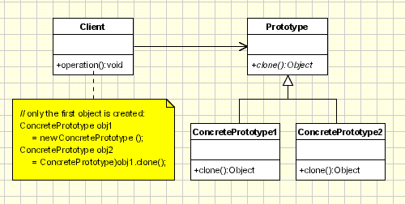
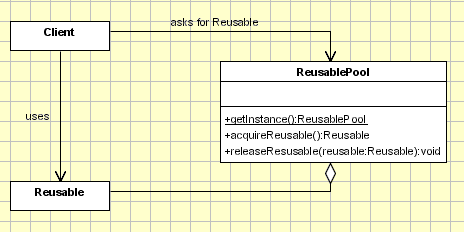

# Creational Design Patterns
Creational design patterns are design patterns which focus on creating objects effectively. They bring flexibility to the software design and help in the reusability of existing code. There are mainly 6 types of creational design patterns: Factory Method, Abstract Factory, Singleton, Prototype, Builder and Object Pool pattern.

## Factory Method
The Factory Method provides an interface for creating objects but allows subclasses to alter the type of objects that will be created. In other words, it declares an interface for creating an object, but the specific subclass implementing the factory method determines the class of objects that will be instantiated.

### Use Cases
- Hide the existence of subclasses from the client
- i.e. We order an ice cream cone (either vanilla, chocolate or strawberry) from a store. We aren't concerned with the process of making the ice cream, the ingredients that go into it. The internal call by the shopkeeper to create a vanilla, chocolate, or strawberry ice cream is hidden from the user.

### Main Idea
- Factory Method can produce only one type of object (only icecreams)
- Simplifying the creation of different Products of similar types

### Key Components
1. Creator -> Interface or Abstract Class. Declares the Factory Method that creates Products. Can declare other methods for the Products. 
2. Concrete Creator -> Class implements or is a sub-class of Creator. Each concrete creator implements the factory method to create specific product objects. 
3. Product -> Interface or Abstract Class. Declares the common interface that all concrete product classes must implement.
4. Concrete Product -> Class implements or is a sub-class of Product. Provides its own implementation of the common interface.

## Abstract Factory
The Abstract Factory Pattern creates an object of several families of classes. Lets us produce families of related objects without specifying their concrete classes. One generalized factory can consist of multiple specialized factories, each producing a different kind of object.

### Use Cases
- Often used in scenarios where you need to ensure that the objects you create are consistent and compatible within a certain context. 
- It is commonly used in GUI libraries, where different platforms (e.g., Windows, macOS, Linux) require different families of widgets (buttons, text fields, etc.).
- i.e. A multi-cuisine restaurant that serves different kinds of foods like Chineese, Indian and French. There might be different chefs for each cusines/dish, but we aren't concerned with that. We order a dish from a cusine, and don't care how or where it's made. 

### Main Idea
- Abstract Factory can produce a family of different kinds of objects (multi-course and multi-cuisine meals)

### Key Components
1. Abstract Factory -> Interface or Abstract Class. Declares a set of factory methods, each responsible for creating a family of related objects. 
2. Concrete Factories -> Class implements or is a sub-class of Abstract Facotry. Each concrete factory is responsible for creating a family of objects that are compatible with each other.
3. Abstract Products -> Interface or Abstract Class. Declares the common interface that all concrete product classes must implement. Abstract products are typically organized into different families, each associated with a specific factory.
4. Concrete Products -> Class implements or is a sub-class of Product. Provides its own implementation of the common interface. Each concrete product belongs to a specific family and provides its own implementation of the declared methods.

## Singleton
The Singleton Pattern specifies that only one instance can be instantiated from a given class. It ensures that a class has only one instance and provides a global access point to this particular instance. Singleton pattern helps in saving memory since the object is not created at every request. It either creates a new object or returns an existing object which has already been created.

### Use Cases
- Used when a given class can have only one instance is available to all clients. 
- For example, a single database object which is shared by all the different parts of a program is an example of a singleton class.

### Main Idea
- 

### Key Components
1. Abstract Factory -> Interface or Abstract Class. Declares a set of factory methods, each responsible for creating a family of related objects. 

## Prototype

## Builder

## Object Pool

