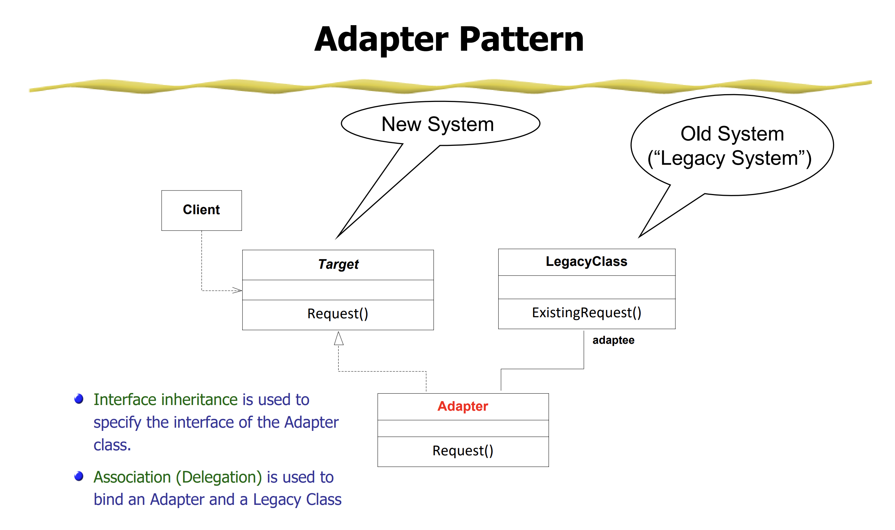
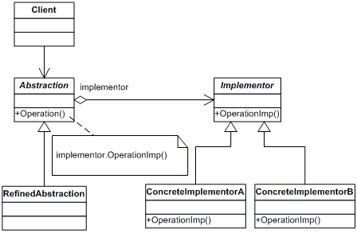
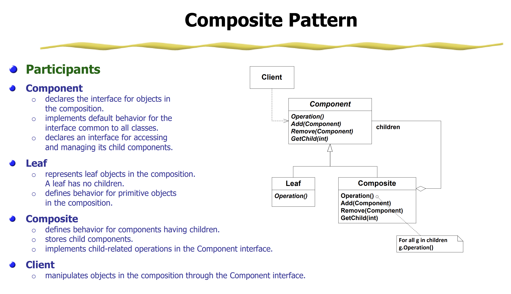

# Strucutral Design Patters
Use composition for merging classes and objects into a bigger structure to solve complex problems, making 
a solution extensible and flexible

## Adapter Pattern
The adapter pattern helps in converting the interface of a class into another interface depending on the client's requirements. So, basically providing what is required by the client by using the service of a class with a different interface. Adapter pattern is also famously known as Wrapper. In other words, it allows two incompatible interfaces to work together. The Adapter Pattern involves creating a new class (the adapter) that acts as a bridge between the existing class and the target interface.

### Use Case:
- Using Legacy Code with an incompatible interface

### Main Idea: 
- When you want to use the functionality of a class, but the client has different requirements that are incompatible with the existing class

### Key Components:
1. Target Interface -> The interface the client code expects to work with. Represents the functionality the client needs
2. Adaptee -> Existing class who's functionality we need, but its interface is incompatible with the target interface
3. Adpater -> A new class to bridge the 2. Implements the Target Interface and holds a reference to the Adaptee. Wrpas around the Adaptee to take client requests from Target Interface methods and convert them into requests the Adaptee understands

## Bridge Pattern
The bridge pattern is designed to separate an object's abstraction from its implementation. The main goal is to decouple an abstraction and its implementation so that they can vary independently. Part of the Gang of Four (GoF) design patterns.

### Use Case
- When we need to code something that will have multiple implementations and also multiple abstractions
- For example, Imagine you are building a GUI library that needs to support multiple platforms (e.g., Windows and Linux) and multiple rendering engines (e.g., DirectX and OpenGL). The Bridge Pattern helps you separate the platform-specific code (implementation) from the GUI elements (abstraction).

### Main Idea:
- Have a base Interface and base Abstract Class that has a reference to the base Interface.
- Then you can have any other classes extend or implement the above

### Key Components
1. Implementor -> Base Interface. 
2. Abstraction -> Base Abstract Class. Has a reference to the Implementor.
3. Concrete Implementor(s) -> Concrete Classes. Provide specific implementations of Implementor.
4. Concrete Abstraction(s) -> Concrete Classes. Extend Abstraction. 

## Composite Pattern
In a composite pattern, the client is able to operate objects which may or may not represent its hierarchy. In simple terms composite pattern allows you to create hierarchical tree of unique complexities which allows treating every object individually.

### Use Case
- When you want to add new kinds of components to specific objects
- It provides manageable interfaces and flexibility in its structure.
- It helps to define hierarchies containing complex and primitive objects.

### Main Idea
- Create larger components from smaller components to improve reusability 
- For example, A drawing simulator draws shapes like lines, circles, squares..etc. Without composite pattern, you would need a class for each of these shapes, but a square is really just 4 lines. With composite, you utilize the lines class to prevent duplicate code

### Key Components
1. Component -> Interface for the objects in the composition. Declares an interface for accessing and managing its child components.
2. Leaf -> Class extends Component. Defines behavior for primitive objects in the composition. A leaf has no children.
3. Composite -> Class extends Component. Implements child-related behavior. Has children.

## Decorator Pattern
Decorator is a structural pattern that allows adding new behaviors to objects dynamically by placing them inside special wrapper objects, called decorators. Often used to extend the functionality of classes in a flexible and reusable way, without modifying their source code.

In Decorator Pattern, we can add or remove object functionality without changing the function or external appearance of the object. Therefore with help of a decorator pattern, we can add additional responsibilities to an object without changing the functionalities of the object.

### Method 1: Classes 
Creating multiple decorators to extend the functionality of a concrete class in multiple ways

#### Use Case -> Classes:
- Multiple Decorations with State - When you need to apply multiple decorators to a class or method, especially if these decorators need to maintain state or share information with each other
- Complex Decorations - For complex scenarios where you need to manage and coordinate multiple decorators with potentially intricate interactions
- Reusable Decorator Logic - To encapsulate and reuse the decoration logic across multiple classes or methods

#### Main Idea -> Classes:
- Wrap an existing class with one or more decorator classes, each adding new functionality or behavior to the original class.
- Decorators are stacked on top of each other, allowing you to combine features or responsibilities dynamically.

#### Key Components -> Classes:
1. Component -> The base interface or abstract class. Defines the common interface for both the concrete components (original class to be extended) and the decorators (classes that add functionality)
2. Concrete Component -> The original class/object you want to enhance or extend
3. Decorator -> An abstract class. Implements the same interface as the component and maintains a reference to that component. Serves as the base class for concrete decorators
4. Concrete Decorator -> A concrete class. Extends the functionality of the component by adding new behavior or state. They override or add new methods to the component while delegating the original behavior to the component.

### Method 2: Functions
Creating a decorator to 'wrap' the functionality of a function. 

#### Use Case -> Functions:
- Simple Wrapping - If you need to apply a single, straightforward transformation or modification to a function or method
- Single Function Modification - Want to modify the behavior of a single function or method

#### Main Idea -> Functions:
- Wrap an existing function with one or more decorator function, each adding new functionality or behavior to the original class.
- Decorators will execute in the order they are applied

#### Key Components -> Functions:
1. The decorator function with an internal function called wrapper that returns the internal function
2. The base function being extended

## Facade Pattern

## Flyweight Pattern

## Proxy Pattern