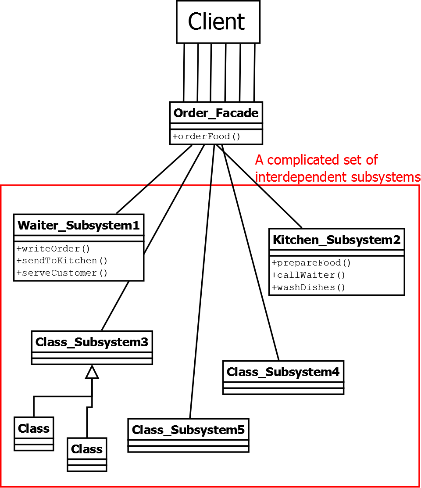

# Strucutral Design Patters
Use composition for merging classes and objects into a bigger structure to solve complex problems, making 
a solution extensible and flexible

## Adapter Pattern
The adapter pattern helps in converting the interface of a class into another interface depending on the client's requirements. So, basically providing what is required by the client by using the service of a class with a different interface. Adapter pattern is also famously known as Wrapper. In other words, it allows two incompatible interfaces to work together. The Adapter Pattern involves creating a new class (the adapter) that acts as a bridge between the existing class and the target interface.

### Use Case:
- Using Legacy Code with an incompatible interface

### Main Idea: 
- When you want to use the functionality of a class, but the client has different requirements that are incompatible with the existing class

### Key Components:
1. Target Interface -> The interface the client code expects to work with. Represents the functionality the client needs
2. Adaptee -> Existing class who's functionality we need, but its interface is incompatible with the target interface
3. Adpater -> A new class to bridge the 2. Implements the Target Interface and holds a reference to the Adaptee. Wrpas around the Adaptee to take client requests from Target Interface methods and convert them into requests the Adaptee understands

## Bridge Pattern
The bridge pattern is designed to separate an object's abstraction from its implementation. The main goal is to decouple an abstraction and its implementation so that they can vary independently. Part of the Gang of Four (GoF) design patterns.

### Use Case
- When we need to code something that will have multiple implementations and also multiple abstractions
- For example, Imagine you are building a GUI library that needs to support multiple platforms (e.g., Windows and Linux) and multiple rendering engines (e.g., DirectX and OpenGL). The Bridge Pattern helps you separate the platform-specific code (implementation) from the GUI elements (abstraction).

### Main Idea:
- Have a base Interface and base Abstract Class that has a reference to the base Interface.
- Then you can have any other classes extend or implement the above

### Key Components
1. Implementor -> Base Interface. 
2. Abstraction -> Base Abstract Class. Has a reference to the Implementor.
3. Concrete Implementor(s) -> Concrete Classes. Provide specific implementations of Implementor.
4. Concrete Abstraction(s) -> Concrete Classes. Extend Abstraction. 

## Composite Pattern
In a composite pattern, the client is able to operate objects which may or may not represent its hierarchy. In simple terms composite pattern allows you to create hierarchical tree of unique complexities which allows treating every object individually.

### Use Case
- When you want to add new kinds of components to specific objects
- It provides manageable interfaces and flexibility in its structure.
- It helps to define hierarchies containing complex and primitive objects.

### Main Idea
- Create larger components from smaller components to improve reusability 
- For example, A drawing simulator draws shapes like lines, circles, squares..etc. Without composite pattern, you would need a class for each of these shapes, but a square is really just 4 lines. With composite, you utilize the lines class to prevent duplicate code

### Key Components
1. Component -> Interface for the objects in the composition. Declares an interface for accessing and managing its child components.
2. Leaf -> Class extends Component. Defines behavior for primitive objects in the composition. A leaf has no children.
3. Composite -> Class extends Component. Implements child-related behavior. Has children.

## Decorator Pattern
Decorator is a structural pattern that allows adding new behaviors to objects dynamically by placing them inside special wrapper objects, called decorators. Often used to extend the functionality of classes in a flexible and reusable way, without modifying their source code.

In Decorator Pattern, we can add or remove object functionality without changing the function or external appearance of the object. Therefore with help of a decorator pattern, we can add additional responsibilities to an object without changing the functionalities of the object.

### Method 1: Classes 
Creating multiple decorators to extend the functionality of a concrete class in multiple ways

#### Use Case -> Classes:
- Multiple Decorations with State - When you need to apply multiple decorators to a class or method, especially if these decorators need to maintain state or share information with each other
- Complex Decorations - For complex scenarios where you need to manage and coordinate multiple decorators with potentially intricate interactions
- Reusable Decorator Logic - To encapsulate and reuse the decoration logic across multiple classes or methods

#### Main Idea -> Classes:
- Wrap an existing class with one or more decorator classes, each adding new functionality or behavior to the original class.
- Decorators are stacked on top of each other, allowing you to combine features or responsibilities dynamically.

#### Key Components -> Classes:
1. Component -> The base interface or abstract class. Defines the common interface for both the concrete components (original class to be extended) and the decorators (classes that add functionality)
2. Concrete Component -> The original class/object you want to enhance or extend
3. Decorator -> An abstract class. Implements the same interface as the component and maintains a reference to that component. Serves as the base class for concrete decorators
4. Concrete Decorator -> A concrete class. Extends the functionality of the component by adding new behavior or state. They override or add new methods to the component while delegating the original behavior to the component.

### Method 2: Functions
Creating a decorator to 'wrap' the functionality of a function. 

#### Use Case -> Functions:
- Simple Wrapping - If you need to apply a single, straightforward transformation or modification to a function or method
- Single Function Modification - Want to modify the behavior of a single function or method

#### Main Idea -> Functions:
- Wrap an existing function with one or more decorator function, each adding new functionality or behavior to the original class.
- Decorators will execute in the order they are applied

#### Key Components -> Functions:
1. The decorator function with an internal function called wrapper that returns the internal function
2. The base function being extended

## Facade Pattern
In Facade Pattern, we provide a simplified interface to a set of interfaces of a subsystem for hiding its complexity of subsystem from the client. In simple words with the help of facade pattern, we make sub-systems easier to use by describing a higher-level interface, OR it provides a simplified interface to a set of interfaces in a subsystem, making it easier to use and understand.

### Use Case
- When there are many dependencies between implementation classes of abstraction and client requirements.
- When you want to have layers in your subsystems.
- When you want to provide a simple interface instead of a complex subsystem.

### Main Idea
- Provide a higher-level, simplified interface to a complex system, shielding clients from the complexities of the subsystem.

### Key Components
1. Facade -> Central Class the Client interacts with. Provides a simplified and unified interface to the Subsystem Classes. Delegates Client requests to appropriate classes within the subsystem. 
2. Subsystem Classes -> Individual Classes and components that make up the complex sytem. Clients can access these classes directly BUT the Facade acts as a high-level interface for them.
3. Client -> Code interacts with the Facade to access the subsystem's functionality. 

## Flyweight Pattern
Flyweight Patterns helps us to reuse similar kinds of existing objects by storing and creating new objects when similar objects are not found. Therefore in simple terms, it helps us to reduce the expense of multiple instances that contains the same data. Reduce memory usage or computational costs by sharing as much as possible with related objects. 

### Use Case
- To reduce storage cost, by reusing similar objects.
- When a large number of similar objects are required.
- When the application is dependent on unique object identity.

### Main Idea
- Split an object's state into two parts: intrinsic and extrinsic.
1. Intrinsic State: This part of the state is common and can be shared among multiple objects. It remains constant across instances and is often stored in a shared data structure.
2. Extrinsic State: This part of the state is unique to each object and cannot be shared. It is passed as a parameter to the methods of the flyweight objects.
- Create a large number of objects efficiently by reusing the shared intrinsic state and minimizing the storage required for the extrinsic state.

### Key Components
1. Flyweight Interface -> Interface or Abstract Class. Declares methods for the Flyweight to imlement. Usually declares a method that accepts the extrinsic state as a parameter.
2. Concrete Flyweight -> Concrete Class implements the Interface. Stores Instrinsic state (can be shared among multilpe instances). Instances of Concrete Flyweight and usually created & managed by Flyweight Factory.
3. Flyweight Factory -> Class. Responsible for creating and managing instances of the Concrete Flyweight class. Ensures Flyweights are reused, and new ones are created when necessary, based on Extrinsic state provided.
4. Client -> Uses Flyweight Objects. Passes the Extrinsic data ehen necessary.

## Proxy Pattern
In Proxy Pattern we provide a placeholder or a surrogate object to control access to the original object. In simple terms, providing a proxy or dummy layer of information before the client before accessing the original data. It falls under the Gang of Four (GoF) design patterns and is designed to provide a surrogate or placeholder for another object to control access to it. 

The Proxy Pattern involves creating a class (the proxy) that has the same interface as the real object it represents. The proxy acts as an intermediary or surrogate, controlling access to the real object.

There's 4 Types of Proxys:
1. Remote Proxy -> used to make interface resources remotely available like a web service.
2. Virtual Proxy -> used when there are multiple database calls being done for extracting a huge file, Since it is an expensive process we can use a virtual proxy to reduce cost.
3. Protective Proxy -> used when there is security or privacy of data is required. With the help of a proxy pattern, we can verify whether the user has access to the data or not.
4. Smart Proxy -> used when we require an extra layer of security for a specific object.

### Use Case
- Controlling access to an object

### Key Components
1. Subject -> Base Interface implemneted by the Real Subject and the Proxy. Defines the methods the Client can use to interact with the Real Subject.
2. Real Subject -> Class implements Subject. Defines all the methods. Actual object the Proxy represents.
3. Proxy -> Class implements Subject. Holds reference to the Real Subject. Delegates Client requests to the Real Subject. Can add functionality beofre or after forewarding requests. 
4. Client -> Client code interacting with the Proxy thinking that it's the Real Subject. 

